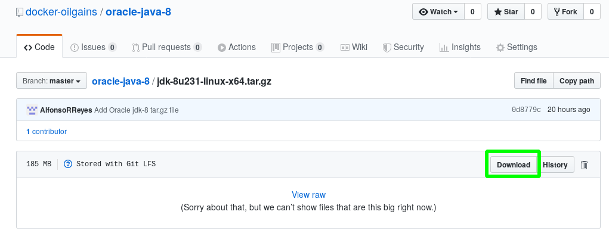
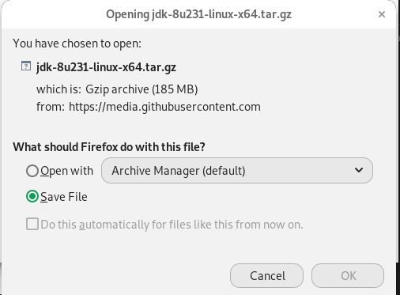

# Compile Java code from a container

[toc]

Source: https://runnable.com/docker/java/dockerize-your-java-application

## Introduction

*   We started originally with the Dockerfile written for the image pulled from `phusion/baseimage`

*   As we already know, **Oracle** has changed its policies regarding Java downloads; they do not allow to download automatically their Java resources. For instance, this will not work anymore:

    ```
    RUN echo 'deb http://ppa.launchpad.net/webupd8team/java/ubuntu trusty main' >> /etc/apt/sources.list && \
        echo 'deb-src http://ppa.launchpad.net/webupd8team/java/ubuntu trusty main' >> /etc/apt/sources.list && \
        apt-key adv --keyserver keyserver.ubuntu.com --recv-keys C2518248EEA14886 && \
        apt-get update && \
    ```

    The `webupd8team` PPA will throw error when we try to install Oracle JDK-8. 

    

*   The Oracle JDK for any version has to be downloaded manually with an Oracle user account, and have to agree with terms and conditions.

*   Therefore, the Dockerfile has to be modified in order to install Oracle JDK-8.

*   After successfully building the Docker image with `phusion/baseimage`, we do the same for Ubuntu and Debian.


## Create a Dockerfile

### Original Dockerfile for `phusion/baseimage`

```dockerfile
# Dockerfile
FROM  phusion/baseimage:0.9.17

RUN echo "deb http://archive.ubuntu.com/ubuntu trusty main universe" > /etc/apt/sources.list

RUN apt-get -y update

RUN DEBIAN_FRONTEND=noninteractive apt-get install -y -q python-software-properties software-properties-common

ENV JAVA_VER 8

# # Define commonly used JAVA_HOME variable
ENV JAVA_HOME /opt/java-jdk/jdk1.8.0_231

# copy Oracle Java8 to container
COPY jdk-8u231-linux-x64.tar.gz .

RUN mkdir /opt/java-jdk
RUN tar -C /opt/java-jdk -zxf ./jdk-8u231-linux-x64.tar.gz
RUN update-alternatives --install /usr/bin/java  java  /opt/java-jdk/jdk1.8.0_231/bin/java 1
RUN update-alternatives --install /usr/bin/javac javac /opt/java-jdk/jdk1.8.0_231/bin/javac 1

RUN echo "export JAVA_HOME=/opt/java-jdk/jdk1.8.0_231" >> ~/.bashrc
```


### Modified Dockerfile for Ubuntu

```
# Dockerfile

FROM ubuntu:16.04

# RUN echo "deb http://archive.ubuntu.com/ubuntu trusty main universe" > /etc/apt/sources.list

RUN apt-get -y update

RUN DEBIAN_FRONTEND=noninteractive apt-get install -y -q python-software-properties software-properties-common

ENV JAVA_VER 8

# # Define commonly used JAVA_HOME variable
ENV JAVA_HOME /opt/java-jdk/jdk1.8.0_231


# copy Oracle Java8 to container
COPY jdk-8u231-linux-x64.tar.gz .

RUN mkdir /opt/java-jdk
RUN tar -C /opt/java-jdk -zxf ./jdk-8u231-linux-x64.tar.gz
RUN update-alternatives --install /usr/bin/java  java  /opt/java-jdk/jdk1.8.0_231/bin/java 1
RUN update-alternatives --install /usr/bin/javac javac /opt/java-jdk/jdk1.8.0_231/bin/javac 1
RUN update-alternatives --install /usr/bin/javaws javaws /opt/java-jdk/jdk1.8.0_231/bin/javaws 1
RUN update-alternatives --install /usr/bin/jcontrol jcontrol /opt/java-jdk/jdk1.8.0_231/bin/jcontrol 1

# RUN echo "export JAVA_HOME=/opt/java-jdk/jdk1.8.0_231" >> ~/.bashrc
```


## Build the image

### `phusion/baseimage`

```
docker build --file Dockerfile -t oracle-java-8:phusion .
```

### Ubuntu OS

```
docker build --file Dockerfile.ubuntu -t ubuntu/oracle-java:8 .
```

### Debian 9


## Compile Java source code with the container

Ensure the Java code is in the same folder where you are running this command.

### `phusion/baseimage`

```
docker run --rm -v $PWD:/app -w /app oracle-java-8:phusion javac Main.java
```

### Ubuntu OS

```
docker run --rm -v $PWD:/app -w /app ubuntu/oracle-java:8 javac Main.java
```

### Debian 9

```
docker run --rm -v $PWD:/app -w /app oracle-java-8:debian javac Main.java
```


## Run the Java class

### `phusion/baseimage`

```
docker run --rm -v $PWD:/app -w /app oracle-java-8:phusion java Main
```

### Ubuntu

```
docker run --rm -v $PWD:/app -w /app ubuntu/oracle-java:8 java Main
```

### Debian

```
docker run --rm -v $PWD:/app -w /app oracle-java-8:debian java Main
```


## Java source code

```java
public class Main
{
     public static void main(String[] args) {
        System.out.println("Hello, World");
    }
}
```


## How to deal with the 194 MB JDK-8 file

In this case the file will not be able to be pushed to Git as the other files; we have to use `Git LFS`.

First, we have to install it, and then follow some instructions to push it as an `LFS` file. We have to be careful of not pushing the big file with the rest of small files in the Git repo otherwise we get stuck without being able to push anything.

### Make the 194 MB  `tar` file a `LFS` file

```
 git lfs track "*.tar.gz"
 git add .gitattributes
 git add jdk-8u231-linux-x64.tar.gz
 git commit -m "Add Oracle jdk-8 tar.gz file"
 git push origin master
```

Now, we can deal with the smaller files.

### Download the 194 MB file from GitHub

Just click on the download button:



And save it as we usually do with any file:




### Get the 194 MB file from GitHub with `wget`

In DockerHub we will not be able to use the `Dockerfile` command `COPY` to copy the file `jdk-8u231-linux-x64.tar.gz` that is living in the **GitHub** repo; we have to obtaining it using the Linux command `wget`. So, we add this line to the Dockerfile to "download" the 194 MB file:

```
RUN wget --quiet https://github.com/docker-oilgains/oracle-java-8/raw/master/jdk-8u231-linux-x64.tar.gz
```

>   This will run in **DockerHub** and **Travis**.

## Notes

1.  To build this container based on Oracle JDK-8, we made use of `Git LFS`. The `tar` file was downloaded manually from Oracle and then pushed as a `LFS`  file.

2.  The way a Docker image is built in **DockerHub** is different than the way the image is built in **Travis**. In Travis the command `COPY` works for the Java `tar` file while in DockerHub only copies the string with the Git address to the file.

3.  Downloading multiple times from LFS in GitHub produces this error:
    

    ```
    Error downloading object: jdk-8u231-linux-x64.tar.gz (76062c8): Smudge error: Error downloading jdk-8u231-linux-x64.tar.gz (76062c86e9177baf1417e714bd399ee05ee76dcaf7a33a5e18ac7459ff61afe2): batch response: This repository is over its data quota. Account responsible for LFS bandwidth should purchase more data packs to restore access.
    ```

    About Git LFS excess bandwidth, read here:

    *   https://help.github.com/en/github/managing-large-files/about-storage-and-bandwidth-usage
    *   https://github.com/nabla-c0d3/nassl/issues/17
    *   https://stackoverflow.com/questions/56410647/how-to-get-large-files-from-git-lfs-when-error-even-though-you-have-credits

    

